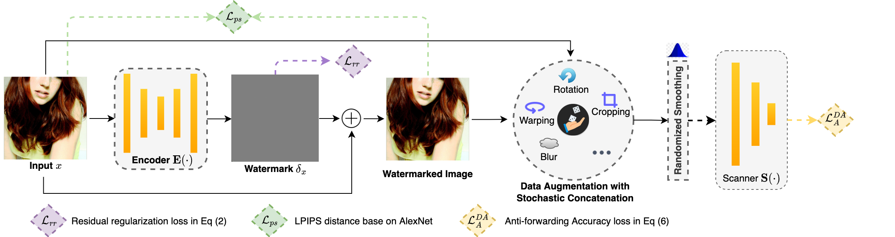

 
 

  
  
  <h3 align="center"><strong>Only For You: Deep Neural Anti-Forwarding Watermark Preserves Image Privacy</strong></h3>

  

      <a href="https://scholar.google.com/citations?user=2PxlmU0AAAAJ" target='_blank'>Xinghua Qu</a>1,&nbsp;
      <a href="https://scholar.google.com/citations?user=SP4eIUYAAAAJ&hl=en" target='_blank'>Alvin Chan</a>2,&nbsp;
      <a href="https://scholar.google.com/citations?user=h9oWOsEAAAAJ&hl=en" target='_blank'>Yew-Soon Ong</a>3,4,&nbsp;
      <a href="https://scholar.google.com/citations?user=a94WthkAAAAJ" target='_blank'>Pengfei Wei</a>1,&nbsp;
      <a href="https://scholar.google.com/citations?user=e6_J-lEAAAAJ" target='_blank'>Xiang Yin</a>1,&nbsp;
      <a href="https://www.linkedin.com/in/cschen1205/?locale=en_US" target='_blank'>Caishun Chen</a>4,&nbsp;
      <a href="https://scholar.google.com.sg/citations?user=kJy0fd8AAAAJ&hl=nl" target='_blank'>Zhu Sun</a>4,&nbsp;
      <a href="https://www.semanticscholar.org/author/Zejun-Ma/2919563" target='_blank'>Zejun Ma</a>1
     
  1ByteDance AI Lab&nbsp; 2MIT&nbsp; 3NTU&nbsp; 4A*STAR
  

  

## Introduction
In recent decades, messaging apps (e.g., Facebook Messager, Whatsapp, Wechat, Snapchat) have expanded exponentially, where a huge amount of private image sharing takes place daily. However, within these apps, the possible unauthorised or malicious image forwarding among users poses significant threats to personal image privacy. In specific situations, we hope to send private and confidential images (e.g., personal selfies) in an `**only for you**' manner. Given limited existing studies on this topic, for the first time, we propose the Deep Neu**r**al **A**nti-**F**orwarding Wa**t**ermark (DeepRAFT) that enables media platforms to check and block any unauthorised forwarding of protected images through injecting non-fragile and invisible watermarks. 
 

  
   

 

To this end, we jointly train a DeepRAFT encoder and scanner, where the encoder embeds a confidentiality stamp into images as watermarks, and the scanner learns to detect them. To ensure that the technique is robust and resistant to tampering, we involve a series of data augmentations (mounted on a stochastic concatenation process) and randomized smoothing (a scalable and certified defense) towards both common image corruptions (e.g., rotation, cropping, color jitters, defocus blur, perspective warping, pixel noise, JPEG compression) and adversarial attacks (i.e., under both black and white box settings). The training pipeline is shown as below.
 

  
   

 

## Installtion & Datasets
