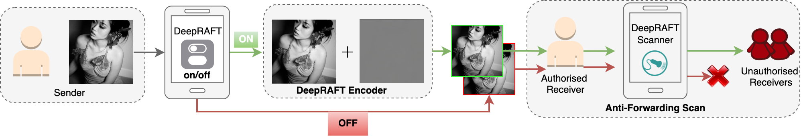
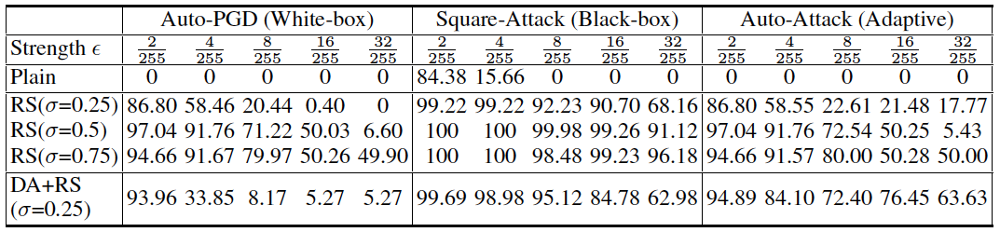

  [](#license "Go to license section")
  [](https://python.org "Go to Python homepage")
 
 
<!--  
  -->
<p align="center">
  
  
  <h3 align="center"><strong>Only For You: Deep Neural Anti-Forwarding Watermark Preserves Image Privacy</strong></h3>

  <p align="center">
      <a href="https://scholar.google.com/citations?user=2PxlmU0AAAAJ" target='_blank'>Xinghua Qu</a><sup>1</sup>,&nbsp;
      <a href="https://scholar.google.com/citations?user=SP4eIUYAAAAJ&hl=en" target='_blank'>Alvin Chan</a><sup>2</sup>,&nbsp;
      <a href="https://scholar.google.com/citations?user=h9oWOsEAAAAJ&hl=en" target='_blank'>Yew-Soon Ong</a><sup>3,4</sup>,&nbsp;
      <a href="https://scholar.google.com/citations?user=a94WthkAAAAJ" target='_blank'>Pengfei Wei</a><sup>1</sup>,&nbsp;
      <a href="https://scholar.google.com/citations?user=e6_J-lEAAAAJ" target='_blank'>Xiang Yin</a><sup>1</sup>,&nbsp;
      <a href="https://www.linkedin.com/in/cschen1205/?locale=en_US" target='_blank'>Caishun Chen</a><sup>4</sup>,&nbsp;
      <a href="https://scholar.google.com.sg/citations?user=kJy0fd8AAAAJ&hl=nl" target='_blank'>Zhu Sun</a><sup>4</sup>,&nbsp;
      <a href="https://www.semanticscholar.org/author/Zejun-Ma/2919563" target='_blank'>Zejun Ma</a><sup>1</sup>
    <br>
  <sup>1</sup>ByteDance AI Lab&nbsp; <sup>2</sup>MIT&nbsp; <sup>3</sup>NTU&nbsp; <sup>4</sup>A*STAR
  </p>
</p>

<p align="center">
  <a href="https://openreview.net/forum?id=79VEVKQxekf&referrer=%5BAuthor%20Console%5D(%2Fgroup%3Fid%3DICLR.cc%2F2023%2FConference%2FAuthors%23your-submissions)" target='_blank'>
    
  </a>
</p>

## Introduction
In recent decades, messaging apps (e.g., Facebook Messager, Whatsapp, Wechat, Snapchat) have expanded exponentially, where a huge amount of private image sharing takes place daily. However, within these apps, the possible unauthorised or malicious image forwarding among users poses significant threats to personal image privacy. In specific situations, we hope to send private and confidential images (e.g., personal selfies) in an `**only for you**' manner. Given limited existing studies on this topic, for the first time, we propose the Deep Neu**r**al **A**nti-**F**orwarding Wa**t**ermark (DeepRAFT) that enables media platforms to check and block any unauthorised forwarding of protected images through injecting non-fragile and invisible watermarks. 
<br>
<p align="center">
  
  <br>
</p>
<br>

To this end, we jointly train a DeepRAFT encoder and scanner, where the encoder embeds a confidentiality stamp into images as watermarks, and the scanner learns to detect them. To ensure that the technique is robust and resistant to tampering, we involve a series of data augmentations (mounted on a stochastic concatenation process) and randomized smoothing (a scalable and certified defense) towards both common image corruptions (e.g., rotation, cropping, color jitters, defocus blur, perspective warping, pixel noise, JPEG compression) and adversarial attacks (i.e., under both black and white box settings). The training pipeline is shown as below.
<br>
<p align="center">
  
  <br>
</p>
<br>

## Installtion 
Install all dependencies via:
```
pip3 install -r requirements.txt
pip3 install git+https://github.com/fra31/auto-attack
```
`DiffJPEG` is used for differentiable data augmentation on [JPEG compression](https://github.com/mlomnitz/DiffJPEG).
`autoattack` is for adversarial robustness evaluation purpose.

## Datasets
We use two datasets with dimention 400*400. Datsets can be downloaded through the commands below.
```
wget http://press.liacs.nl/mirflickr/mirflickr25k.v3b/mirflickr25k.zip
```
Metafaces dataset can be obtained from [github](https://github.com/NVlabs/metfaces-dataset).
Note: The original metafaces dataset is with 1024*1024 dimention. You can use our `Image_Processing.ipynb` to precess them into 400*400 dimension.
<br>
<p align="center">
  
  <br>
</p>
<br>

## RUN

Baseline training

```python3 train.py --run_name your_name --max_step 200000 ```


Train smoothed scanner with randomized smoothing

```python3 train_rs.py --run_name your_name --max_step 200000 --std 0.5```

Train augmented and smoothed scanner with randomized smoothing together with stochastic concatenation of data augmentations.

```python3 train_rs_aug.py --run_name your_name --max_step 200000 --std 0.5 --aug_start 5000 --aug_end 100000```

## Watermark Invisibility Demos
<br>
<p align="center">
  
  <br>
</p>
<br>

## Results
Table 1: Anti-forwarding watermark detection accuracy
<br>
<p align="left">
  
  <br>
</p>
<br>

Table 2: Subjective evaluation on watermark imperceptibility.
<br>
<p align="left">
  
  <br>
</p>
<br>

Table 2: Adversarial robustness evaluation on auto-PGD, square attack and adaptive auto-attack.
<br>
<p align="left">
  
  <br>
</p>
<br>
